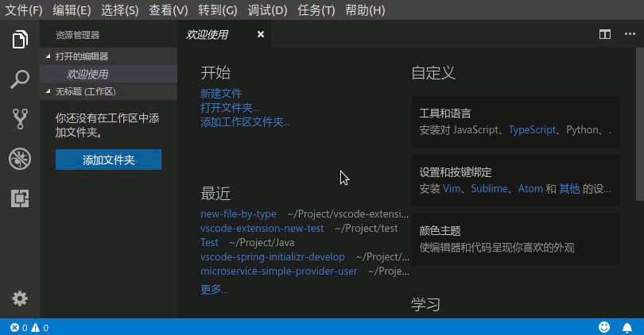
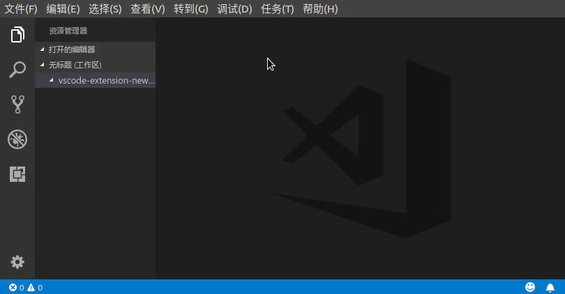
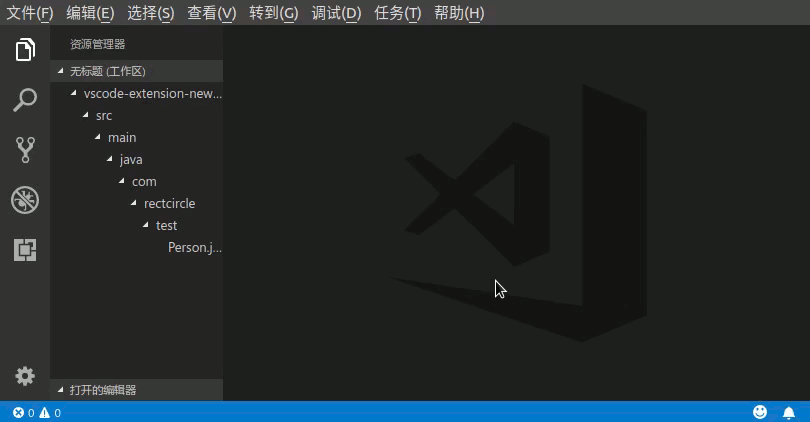

# new-file-by-type

[](https://marketplace.visualstudio.com/items?itemName=Rectcircle.new-file-by-type)


[中文版介绍](#中文版介绍)


**English README from Google Translation**

The purpose of this extension is to make vscode create various types of files like IDEs and generate template code based on what the user fills.


## How to use

* Command panel
  * <kbd>Ctrl+Shift+P</kbd> Start command panel
  * input `New`
* Shortcut
  * <kbd>Ctrl+Alt+N</kbd>


## TODO List

- [ ] GO
- [ ] Python
- [ ] Scala
- [ ] Web
  - [x] HTML5
  - [x] CSS
  - [x] JavaScript(JQuery)
  - [ ] JavaScript(Other Web framework)
- [x] C/C++ project support
  - [x] Class (generate .cpp and .h)
  - [x] Two ordinary files (.c or .cpp and .h)
- [x] Customized Template via Custom Snippet
- [x] Java Project File Support
  - [x] Class
  - [x] Interface
  - [x] Enum
  - [x] Annotation
  - [x] JUnitTestCase
  - [x] Package (package-info file)


## Features

* Supports both Chinese and English languages
* Support for creating code templates based on type
* Support automatic generation of file comments and configuration of various options
* Support code indentation configuration
* Support for creating files from custom Snippet mode


If no directory is open in the current workspace, select the directory and add the directory to the workspace



Create a Java Class file



Create a file and fill it with Snippet




## Extension Settings


Code annotation configuration

* `new-file-by-type.code-comments.enable` Whether to enable document annotations, enabled by default
* `new-file-by-type.code-comments.author` Specifies the name of the author in the code comment of the newly created file. The default value is null, which means the user is logged in using the current operating system.
* `new-file-by-type.code-comments.description` The default description for adding code comments is:`Copyright (c) $year $author`
* `new-file-by-type.code-comments.date-farmat` The format of the creation time in the configuration file comment. The default is `YYYY-MM-DD`, see http://momentjs.com/docs/#/displaying/
* `new-file-by-type.code-comments.version` creates the file's version number information (the value of @version), defaults to `0.0.1`
* `new-file-by-type.code-comments.items` specifies that the code comments for each item default to `["author", "date", "version"]`


Code template indent configuration

* `new-file-by-type.template.defaultIndent` specifies the indentation of the generated code. 0 means use the [tab] character. A value greater than zero indicates that the number of space characters is used. The default value is 0.
* `new-file-by-type.template.indents` According to the file type, specify the code indentation, will override the `new-file-by-type.template.defaultIndent` configuration default configuration see plug-in configuration

Use custom snippet to create a file configuration

```json
"new-file-by-type.snippets":[
  {
    "category": "Web", //Classification, displayed in the first selector
    "name": "HTML5", //The name of the template, shown in the second selector
    "defaultFilename": "index", //Create a file's default file name
    "defaultSrc": "", //Create a file's default source directory
    "suffix": "html", //File extension
    "body": [ //vscode Snippet, to see https://code.visualstudio.com/docs/editor/userdefinedsnippets
      "<!DOCTYPE html>", "<html lang=\"${5:en}\">", "<head>", 
      "    <meta charset=\"UTF-8\">",
      "    <meta name=\"viewport\" content=\"width=${1:device-width}, initial-scale=${2:1.0}\">", 
      "    <meta http-equiv=\"X-UA-Compatible\" content=\"${3:ie=edge}\">", 
      "    <title>${4:Document}</title>", 
      "</head>", 
      "<body>", 
      "    $0",
      "</body>", 
      "</html>"]
  }
]
```


## Release Notes

### 0.0.1

* First release, support for the creation of Java project files
* Support for creating various types of files by customizing Snippet

### 0.0.2

* Basic C/C++ file type support


### 0.0.3

* Change C/C++ code style
* Fix C/C++ Indent Failure
* Complete the creation of basic CSS and JS files


### 0.0.4

* Fix missing C/C++ English prompts
* Improve the creation of Web type files
* The default description for adding code comments is:`Copyright (c) $year $author`


=================================================


# 中文版介绍

这个扩展旨在使vscode可以像IDE一样创建各种类型的文件，并根据用户填写的内容生成模板代码。


## 使用方式

* 命令面板方式
  * <kbd>Ctrl+Shift+P</kbd> 启动命令面板
  * 输入`New`按回车
* 快捷键方式
  * 默认快捷键为 <kbd>Ctrl+Alt+N</kbd>


## TODO列表

- [ ] GO
- [ ] Python
- [ ] Scala
- [ ] Web
  - [x] HTML5
  - [x] CSS
  - [x] JavaScript(JQuery)
  - [ ] JavaScript(其他Web前端框架)
- [x] C/C++项目支持
  - [x] Class（生成.cpp和.h）
  - [x] 普通的两种文件（.c或.cpp和.h）
- [x] 通过自定义Snippet方式实现自定义模板
- [x] Java项目文件的支持
  - [x] Class
  - [x] Interface
  - [x] Enum
  - [x] Annotation
  - [x] JUnitTestCase
  - [x] Package（package-info文件）


## 特性

* 支持中英两种语言
* 支持根据类型创建代码模板
* 支持自动生成文件注释，并可配置各个注释项
* 支持代码缩进方式的配置
* 支持自通过自定义Snippet方式创建文件

如果当前工作区没有目录打开，则选择目录，向工作区添加目录


创建Java Class文件


创建文件并使用Snippet填充内容


## 扩展设置

代码注释的配置

* `new-file-by-type.code-comments.enable` 是否启用生成文档注释功能，默认启用
* `new-file-by-type.code-comments.author` 指定新建文件的代码注释中的作者名，默认为null，代表使用当前操作系统登录用户名
* `new-file-by-type.code-comments.description` 添加代码注释的描述信息默认为：`Copyright (c) $year $author`
* `new-file-by-type.code-comments.date-farmat` 配置文件注释中的创建时间的格式化形式，默认为 `YYYY-MM-DD`，更多参见 http://momentjs.cn/docs/#/displaying/
* `new-file-by-type.code-comments.version` 创建文件的版本号信息（@version的值），默认为 `0.0.1`
* `new-file-by-type.code-comments.items` 指定代码注释各个项目默认为`["author", "date", "version"]`


代码模板缩进配置

* `new-file-by-type.template.defaultIndent` 指定生成代码的缩进方式，0代表使用[tab]字符，大于零表示使用该数目的空格字符，默认为0
* `new-file-by-type.template.indents` 根据文件类型，指定代码缩进方式，将覆盖`new-file-by-type.template.defaultIndent`配置默认配置参见插件配置


使用自定义Snippet方式创建文件的配置
```json
"new-file-by-type.snippets":[
  {
    "category": "Web", //分类，第一个选择器中展示
    "name": "HTML5", //该模板的名字，在第二个选择器中展示
    "defaultFilename": "index", //创建文件的默认文件名
    "defaultSrc": "", //创建文件的默认源代码目录
    "suffix": "html", //文件扩展名
    "body": [ //vscode Snippet 内容 参见https://code.visualstudio.com/docs/editor/userdefinedsnippets
      "<!DOCTYPE html>", "<html lang=\"${5:en}\">", "<head>", 
      "    <meta charset=\"UTF-8\">",
      "    <meta name=\"viewport\" content=\"width=${1:device-width}, initial-scale=${2:1.0}\">", 
      "    <meta http-equiv=\"X-UA-Compatible\" content=\"${3:ie=edge}\">", 
      "    <title>${4:Document}</title>", 
      "</head>", 
      "<body>", 
      "    $0",
      "</body>", 
      "</html>"]
  }
]
```


## 发行说明

### 0.0.1

首次发布
* 支持Java项目文件的创建
* 支持通过自定义Snippet的方式创建各种类型文件

### 0.0.2

* 完成基本C/C++文件类型支持

### 0.0.3

* 更改C/C++代码风格
* 修复C/C++缩进失效问题
* 完成基本的CSS和JS文件的创建


### 0.0.4

* 修复C/C++英文提示缺失问题
* 完善Web类型文件的创建
* 添加代码注释的描述信息默认为：`Copyright (c) $year $author`


