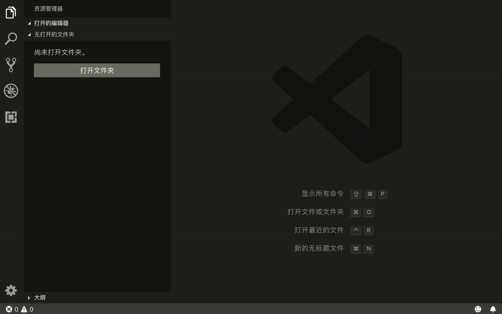
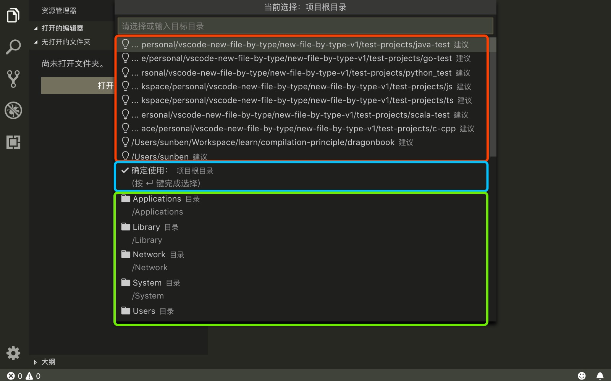
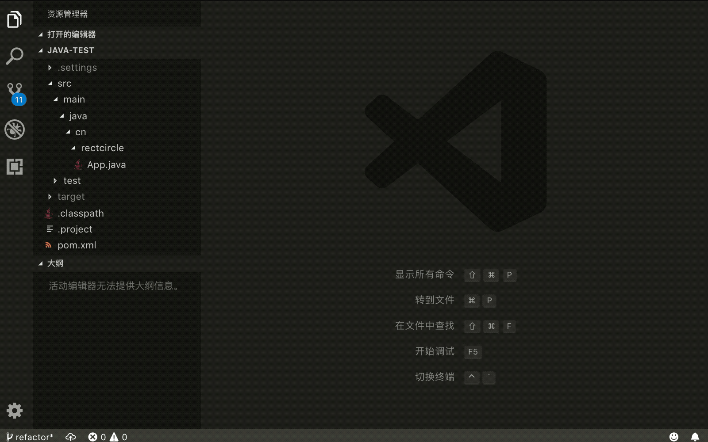
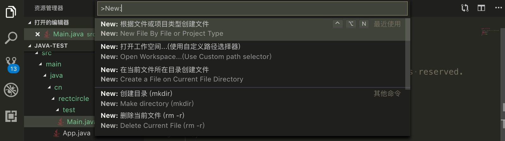
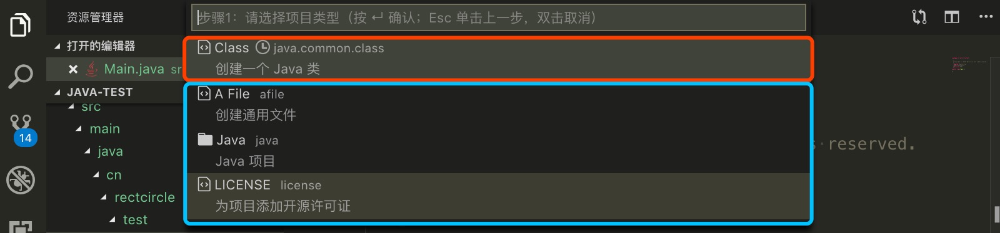
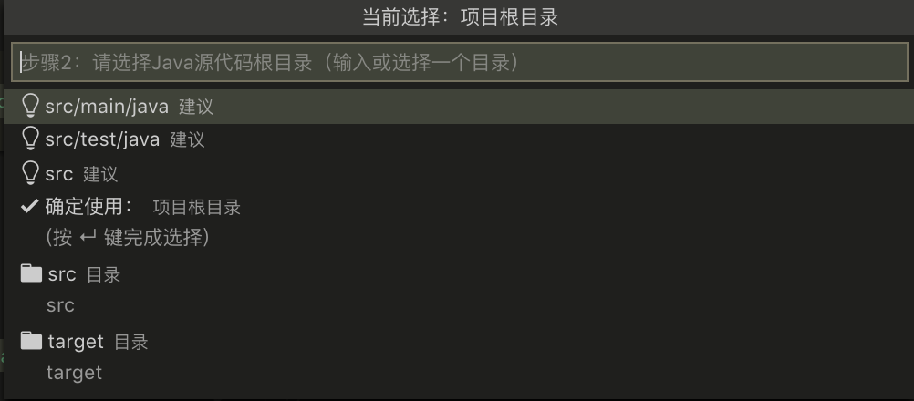
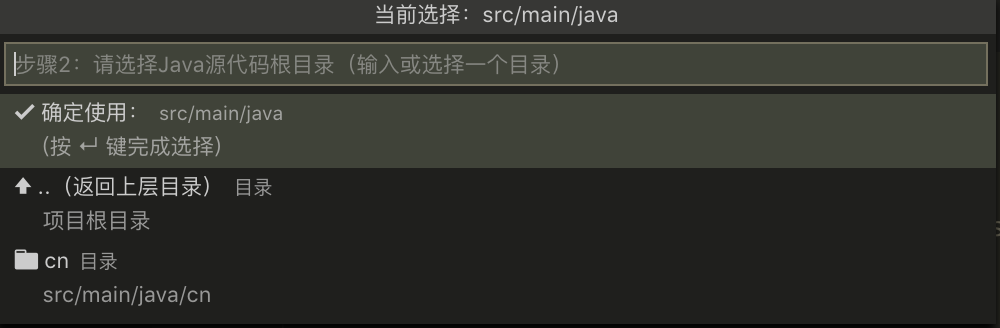
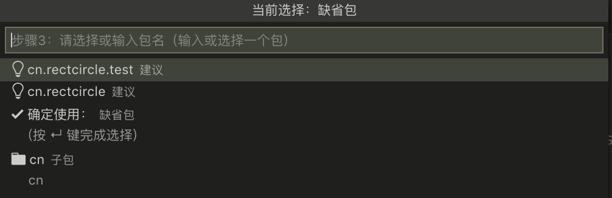
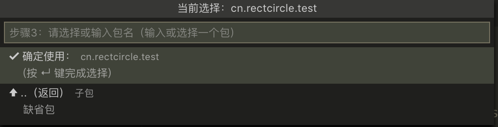
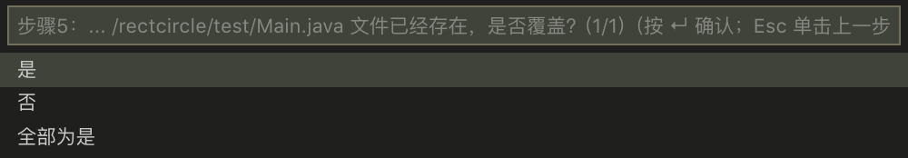

# new-file-by-type

[](https://marketplace.visualstudio.com/items?itemName=Rectcircle.new-file-by-type)

[中文版介绍](https://github.com/rectcircle/new-file-by-type/blob/master/README.md)

> 注意： 1.0版本对本项目进行重写，实现方式完全基于配置，所以导致配置与0.x版本不兼容。

<!-- @import "[TOC]" {cmd="toc" depthFrom=2 depthTo=4 orderedList=false} -->

<!-- code_chunk_output -->

* [特性](#特性)
* [安装](#安装)
* [使用方式](#使用方式)
  * [本插件核心功能](#本插件核心功能)
    * [步骤](#步骤)
    * [特别说明](#特别说明)
    * [命令描述](#命令描述)
  * [本扩展支持的附加功能](#本扩展支持的附加功能)
* [计划支持的项目类型](#计划支持的项目类型)
* [扩展配置](#扩展配置)
* [Contribute](#contribute)
* [发行说明](#发行说明)

<!-- /code_chunk_output -->

这是一个VSCode的方便用户创建创建文件的扩展

这个扩展旨在使VSCode可以像IDE一样创建各种类型的文件，并根据用户填写的内容配合模板生成初始化代码和注释。

## 特性

***

* 在工作区的任意位置创建各种类型项目的文件（如Java、Python、JavaScript等），文件内容基于模板和用户输入生成
* <mark>模板配置完全基于配置文件，欢迎大家pull request，添加自己领域内的通用模板</mark>
* 完全键盘操作
* 自定义路径选择器，更好的交互与UI
* 更优雅的打开工作区，使用自定义路径选择器代替操作系统原生实现
* 优化多步骤输入，支持单击<kbd>Esc</kbd>返回上一步，双击<kbd>Esc</kbd>取消
* 项目支持国际化，支持中英两种语言
* 高度可定制的配置
* 利用自定义路径选择器，实现文件或目录的拷贝、复制和重命名等常见文件系统操作

优雅的打开工作区



高度定制的路径选择器



创建Java类文件示例



## 安装

***

运行VSCode快速打开面板（<kbd>Ctrl+P</kbd>），粘贴如下命令并按回车确认

```
ext install Rectcircle.new-file-by-type
```

## 使用方式

***

### 本插件核心功能

#### 步骤

本扩展使用一般分为3个步骤，分别是：激活命令、选择文件模板、输入模板定义的参数

**第一步：** 使用命令面板（前缀为 `New:`，推荐方式）、快捷键、上下文菜单激活



**第二步：** 选择模板文件

通过2~3步的选择，选择需要创建的文件类型



* 红色区域显示的最近使用过的模板
* 蓝色区域显示的与当前打开工作区匹配的模板文件夹或者模板本身


* 每一个选项的都包含是三个部分
* 红色部分称为Label
  * 包含图标和文字，
  * 图标表示当前选择的是模板还是模板文件夹，
  * 文字为项目名
* 蓝色部分称为Description
  * 如果包含时钟图标，表示该项目是最近使用过的模板，否者为模板列表
  * 文字表示当前模板或文件夹的名字空间（ `namespace` ）
* 黄色部分称为Detail：当前选项的描述（如果不需要可以通过配置取消展示）

**第三步：** 输入模板定义的参数

创建Java类为例，[其配置文件](https://github.com/rectcircle/new-file-by-type/blob/master/template/java/common/class/config.jsonc)一共定义了三个输入参数：分别是

源代码根目录




所在包




类名


如果文件已存在，则会询问是否覆盖（所有新建文件都有此检测）



#### 特别说明

以上步骤，是一个多步骤选择输入的过程，本扩展支持回到上一步输入的功能

#### 命令描述

| 命令名                     | 标识符                               | 激活方式                                                          | 描述                                                     |
| -------------------------- | ------------------------------------ | ----------------------------------------------------------------- | -------------------------------------------------------- |
| 根据文件或项目类型创建文件 | new-file-by-type.new                 | 命令面板、快捷键<kbd>Ctrl+Alt+N</kbd>、资源管理器菜单、上下文菜单 | 在工作空间中，选择文件模板，输入文件位置，并创建一个文件 |
| 在当前文件所在目录创建文件 | new-file-by-type.new-in-current-path | 命令面板、资源管理器菜单、上下文菜单                              | 在工作空间中，选择文件模板，自动推断路径，并创建一个文件 |

> 根据文件或项目类型创建文件 与 在当前文件所在目录创建文件 的区别在于：后者比前者少一些关于路径的模板输入的填写，后者内部通过推测进行。比如同样的 Java 类模板，后者将不用填写所在包这一自定义输入

### 本扩展支持的附加功能

| 命令名                                | 标识符                          | 激活方式                             | 描述                                                       |
| ------------------------------------- | ------------------------------- | ------------------------------------ | ---------------------------------------------------------- |
| 拷贝当前文件                          | new-file-by-type.copy-file      | 命令面板、资源管理器菜单、上下文菜单 | 拷贝当前激活或者选中的文件或目录                           |
| 删除当前文件                          | new-file-by-type.delete-file    | 命令面板、资源管理器菜单、上下文菜单 | 删除当前激活或者选中的文件或目录                           |
| 移动当前文件                          | new-file-by-type.move-file      | 命令面板、资源管理器菜单、上下文菜单 | 移动当前激活或者选中的文件或目录                           |
| 创建目录                              | new-file-by-type.make-directory | 命令面板、资源管理器菜单、上下文菜单 | 在当前激活文件或选中的文件所在目录 或 选中的目录中创建目录 |
| 选择路径...                           | new-file-by-type.path-operation | 命令面板                             | 选择路径并选择执行上述操作                                 |
| 打开工作空间...(使用自定义路径选择器) | new-file-by-type.open-workspace | 命令面板                             | 打开工作空间                                               |

## 计划支持的项目类型

***

* [x] GO
* [x] Python
  * [x] Django
  * [x] Flask  
* [x] Scala
  * [x] App
  * [x] Class
  * [x] Object
  * [x] Trait
  * [x] Class&Object
  * [x] Trait&Object
  * [x] Package Object
  * [x] Scala Worksheet
  * [x] Scala Script
* [x] License
  * [x] Apache-2.0
  * [x] BSD-3-Clause
  * [x] BSD-2-Clause
  * [x] GPL-2.0
  * [x] GPL-3.0
  * [x] LGPL-2.0
  * [x] LGPL-2.1
  * [x] LGPL-3.0
  * [x] MIT
  * [x] MPL-2.0
  * [x] CDDL-1.0
  * [x] EPL-1.0
  * [x] The Unlicense
* [x] 普通文件
* [x] TypeScript
  * [x] None
  * [x] Module
  * [x] React
  * [x] Angular
  * [x] Vue
* [x] JavaScript
  * [x] None
  * [x] JQuery
  * [x] Node-Module
  * [x] ES6-Module
  * [x] React
  * [x] Vue
* [x] Web
  * [x] HTML
  * [x] HTML5 (from Snippet)
  * [x] CSS (from Snippet)
  * [x] Less (from Snippet)
  * [x] Sass (from Snippet)
* [x] C/C++项目支持
  * [x] Class（生成.cpp和.h）
  * [x] 普通的两种文件（.c或.cpp和.h）
* [x] 通过自定义Snippet方式实现自定义模板
* [x] Java项目文件的支持
  * [x] Class
  * [x] Interface
  * [x] Enum
  * [x] Annotation
  * [x] JUnitTestCase
  * [x] Package（package-info文件）

## 扩展配置

***

打开命令面板，输入 `New: help` 打开帮助页面查看。

## Contribute

***

欢迎贡献模板和代码，模板贡献参见：[自定义模板](https://github.com/rectcircle/new-file-by-type/wiki/CustomTemplate)

### Contributor list

* [Rectcircle](https://www.rectcircle.cn)

## 发行说明

***

[参见CHANGELOG.md](https://github.com/rectcircle/new-file-by-type/blob/master/CHANGELOG.md)
